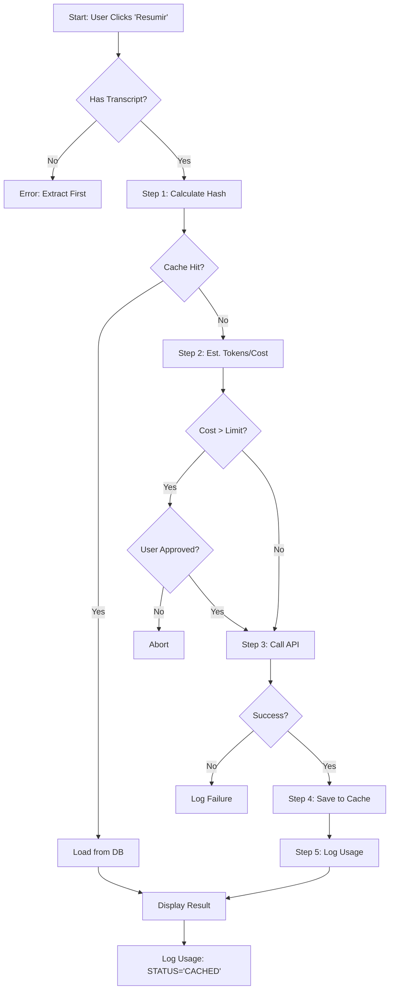

# FASE 5.6: FLUXOS DECISIONAIS (FLOWS)

Este documento mapeia os fluxos lógicos que o sistema deve seguir. Eles são "hardcoded" na lógica de negócio e não devem ser contornados.

## 1. Fluxo Mestre: Processamento de IA (Seguro)

Este fluxo descreve o caminho de um usuário clicando em "Gerar Resumo".



## 2. Fluxo de Extração com Defesa

Este fluxo descreve como o `YouTubeManager` lida com hostilidade.

```mermaid
graph TD
    A[Start: Next URL] --> B[Check Cooldown Timer]
    B --> C{In Cooldown?}
    C -- Yes --> D[Wait / Skip]
    C -- No --> E[Attempt Download]
    
    E --> F{Result?}
    F -- Success --> G[Reset Error Count]
    F -- 404/Deleted --> H[Mark Fatal Error]
    F -- 429 (Block) --> I[Increment Error Count]
    
    I --> J{Errors > Limit?}
    J -- Yes --> K[ACTIVATE COOLDOWN]
    K --> L[Notify User]
    J -- No --> M[Linear Backoff Wait]
    M --> N[Retry (Max 3)]
```

## 3. Breakpoints Obrigatórios

O sistema deve pausar e aguardar input (ou falhar se for batch) nestes pontos:

1.  **Aprovação de Custo Excedente:** Se o custo estimado > Configuração, o processamento para e exibe modal.
2.  **Erro de API Key:** Se a chave for inválida, o sistema não retenta em loop; ele pausa a fila inteira.
3.  **Cooldown Ativo:** Se o sistema estiver em cooldown, o botão de "Processar" deve ficar desabilitado ou avisar que está em espera.

## 4. Persistência de Estado (Cooldown & Fila)

Para evitar perda de trabalho durante pausas forçadas:

1.  **Persistência da Fila:** O status da fila (`processing`, `pending`) deve ser salvo no SQLite (`videos.status`) a cada transição.
2.  **Lógica de Recuperação (Restart):**
    *   `UPDATE videos SET status = 'PENDING' WHERE status = 'PROCESSING'`
    *   Se `cooldown_until > Now()`, manter UI bloqueada.
    *   Se `retry_count` exceder limite, mover para `ERROR` final.
3.  **Persistência do Timer:** O timestamp de início do Cooldown DEVE ser salvo em uma tabela `app_state` (ou `kv_store`).
    *   `app_state.key = 'cooldown_until'`
    *   `app_state.value = ISO8601 Timestamp`
3.  **Boot Check:** Ao abrir o app, verificar: `if Now() < cooldown_until: Resume Cooldown`.

## 5. Comportamentos Default (Fail-Safe)

*   **Na dúvida, NÃO gaste:** Se a estimativa de token falhar (erro no tiktoken), a chamada de API é abortada.
*   **Na dúvida, NÃO martele:** Se o YouTube retornar um código de erro desconhecido, trate como 429 e faça backoff, não retry imediato.
