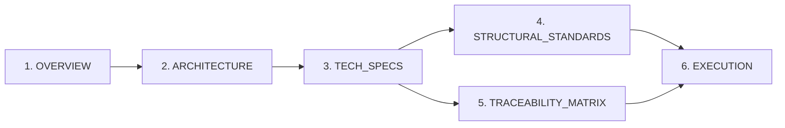
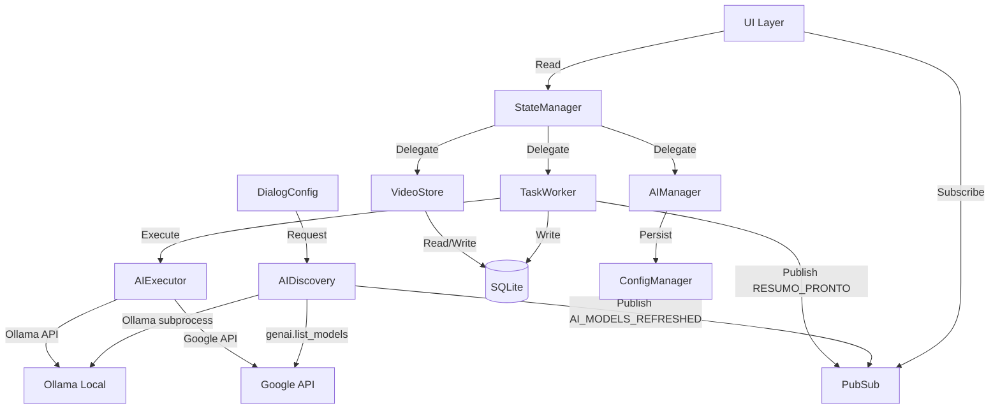

# Plano de Producao da Documentacao da Fase 6

## Comparacao de Abordagens (3 modelos consultados)

| Aspecto | Plano 1 (Detalhista) | Plano 2 (Governanca) | Plano 3 (Pragmatico) |
|---|---|---|---|
| **Forca** | DDL completo, Gherkin, rollback por sub-fase, tabela imports permitidos/proibidos | Glossario formal, namespace de IDs, tabela `ai_tasks` persistente, Gap Report | Foco em QA e PR/commit chunks |
| **Fraqueza** | Pode gerar docs muito extensos | Over-engineering em governanca | Menos detalhe estrutural |
| **Recomendacao** | **BASE PRINCIPAL** - mais alinhado com o Meta-Comando | Incorporar glossario e tabela `ai_tasks` | Incorporar verificacao por etapa |

**Decisao**: Usar Plano 1 como base, enriquecido com o glossario e a tabela `ai_tasks` do Plano 2, e a verificacao incremental do Plano 3.

---

## Escopo da Fase 6

### Sub-fases

| Sub-fase | Descricao |
|---|---|
| **6.0** | Refatoracao "Bisturi" do `app_state.py` (God Class -> modulos isolados) |
| **6.1** | Seletor Inteligente (AI Discovery + selecao manual persistente) |
| **6.2** | Motor de Resumo Isolado (stateless, async, persistencia atomica) |
| **6.3** | Sistema de Tags + Tokenizacao Multi-Modelo |
| **6.4** | Sistema de Fila com Slots + Pop-up de Check-out |

### Invariantes Inviolaveis
1. Sistema NUNCA troca modelo sem acao manual explicita do usuario
2. Cada sumarizacao recebe contexto limpo (system prompt resetado)
3. Resumos persistidos no SQLite ANTES de qualquer exibicao na UI
4. Slot local Ollama limitado a 1 task concorrente
5. Padroes PubSub/Observer/`wx.CallAfter` existentes preservados
6. `main.py`, `ui/virtual_table.py`, `core/pubsub.py` NAO sao refatorados

---

## Ordem de Criacao dos Documentos



---

## 1. PHASE_6_OVERVIEW.md

**Funcao**: Direcao estrategica e limites formais.

### Conteudo Planejado:
- **Objetivo de Negocio**: Transformar o ContextFlow em estacao de triagem com IA soberana - resumir videos em lote (inclusive 4h+) com isolamento de contexto e controle total do usuario
- **Problema Resolvido**: God Class impedindo manutencao por IA, ausencia de sumarizacao, vazamento de contexto, travamento de UI
- **Metricas de Sucesso**:
  - Zero freezes de UI durante resumos de videos > 2h
  - Erro de contagem de tokens < 1% por provedor
  - 100% dos resumos persistidos antes da exibicao
  - `app_state.py` reduzido a <=100 linhas (facade)
- **Escopo Fechado**:
  - INCLUI: Refatoracao state, AI Discovery (Ollama/Google), Motor de resumo async, Tags M2M, Tokenizacao multi-modelo, Fila com slots, Check-out popup
  - NAO INCLUI: Chat interativo, fallback automatico, dark mode (Fase 7), RAG/embeddings/FTS5, multi-user, Docker
- **Invariantes** (INV-01 a INV-06 listados acima)
- **Dependencias Externas**: Ollama binary, Google GenAI API, tiktoken
- **Riscos Estrategicos**: Tabela Risco/Probabilidade/Impacto/Mitigacao (VRAM overflow, rate limit, tag entropy, context leakage)
- **Criterios de Conclusao** (binarios, checkbox):
  - [ ] Model selector populado dinamicamente
  - [ ] 1 video sumarizado end-to-end (Ollama) com resultado no SQLite + UI
  - [ ] 1 video sumarizado end-to-end (Google) com resultado no SQLite + UI
  - [ ] Tags extraidas e persistidas M2M
  - [ ] Checkout popup exibe token count correto
  - [ ] Fila processa 5 videos sequencialmente sem UI freeze
  - [ ] Testes da Fase 5 continuam passando

---

## 2. PHASE_6_ARCHITECTURE.md

**Funcao**: Arquitetura formal e contratos internos.

### Conteudo Planejado:
- **Arquitetura em 5 Camadas**:
  1. **Discovery** (stateless) - `services/ai_discovery.py`
  2. **Configuration** (persistente) - `core/state/ai_manager.py`
  3. **Execution** (isolada) - `services/ai_executor.py` + `core/state/task_worker.py`
  4. **State** (SSoT) - `core/state/state_manager.py` + `video_store.py`
  5. **Presentation** (reativa) - UI existente + novos componentes

- **Diagrama Mermaid Obrigatorio**:


- **Fluxos Operacionais Numerados**:
  - **Flow A**: Discovery (UI -> ai_discovery -> provider -> UI dropdown)
  - **Flow B**: Sumarizacao unitaria (User click -> ai_manager check -> task_worker enqueue -> ai_executor run -> SQLite persist -> PubSub RESUMO_PRONTO -> UI display)
  - **Flow C**: Batch com Check-out (User selects N videos -> token count batch -> checkout popup -> confirm -> task_worker batch enqueue -> sequential processing)

- **Tabela de Novos Arquivos a CRIAR**:

| Arquivo | Responsabilidade | Max Linhas |
|---|---|---|
| `core/state/__init__.py` | Re-exports backward compat | 20 |
| `core/state/state_manager.py` | SSoT facade, RLock, observer dispatch | 150 |
| `core/state/video_store.py` | CRUD videos, snapshot cache | 150 |
| `core/state/ai_manager.py` | Config AI, provider/model state, execution lock | 120 |
| `core/state/task_worker.py` | Fila AI, semaforos de slot, ThreadPoolExecutor | 200 |
| `services/ai_discovery.py` | Enumeracao stateless de modelos | 120 |
| `services/ai_executor.py` | Sumarizacao stateless, prompt template | 150 |

- **Tabela de Arquivos a MODIFICAR**:

| Arquivo | Alteracao |
|---|---|
| `core/app_state.py` | Reduzir a thin facade delegando para `core/state/*` |
| `storage/db_handler.py` | Adicionar tabelas Phase 6 + migrate |
| `ui/dialog_config.py` | Aba de selecao de modelo AI com dropdown dinamico |
| `core/token_engine.py` | Adicionar `count_tokens_for_model()` multi-familia |
| `ui/tab_analysis.py` | Botao "Gerar Insights" + exibicao de resumo |
| `ui/panel_detail.py` | Renderizacao de resumo estruturado |

- **Arquivos PROTEGIDOS (nao podem ser alterados)**:

| Arquivo | Justificativa |
|---|---|
| `main.py` | Entry point estavel |
| `ui/virtual_table.py` | Motor de virtualizacao validado na Fase 5 |
| `core/pubsub.py` | Contrato de eventos congelado |
| `services/youtube_manager.py` | Camada de extracao isolada |

- **Estrategia de Concorrencia**: Semaphore(1) para Ollama, Semaphore(N) para Cloud
- **Estrategia de Rollback**: Tag `PRE_PHASE_6` antes de qualquer alteracao; cada sub-fase commitada separadamente

---

## 3. PHASE_6_TECH_SPECS.md

**Funcao**: Contrato tecnico executavel.

### Conteudo Planejado:

- **Glossario Formal**: Provider, Model, Family, Task, Slot, Queue, Atomic Dump, Stateless Summary, SSoT

- **Modelo de Dados (DDL Completo)**:
```sql
CREATE TABLE video_insights (
    id INTEGER PRIMARY KEY AUTOINCREMENT,
    video_id TEXT NOT NULL,
    model_used TEXT NOT NULL,
    provider TEXT NOT NULL,
    system_prompt_checksum TEXT NOT NULL,
    raw_response TEXT,
    parsed_json TEXT NOT NULL,
    token_input INTEGER NOT NULL,
    token_output INTEGER NOT NULL,
    processing_ms INTEGER,
    created_at TIMESTAMP DEFAULT CURRENT_TIMESTAMP,
    FOREIGN KEY (video_id) REFERENCES videos(id)
);

CREATE TABLE video_tags (
    id INTEGER PRIMARY KEY AUTOINCREMENT,
    tag_name TEXT NOT NULL UNIQUE COLLATE NOCASE,
    source TEXT NOT NULL CHECK(source IN ('ai', 'manual')),
    created_at TIMESTAMP DEFAULT CURRENT_TIMESTAMP
);

CREATE TABLE rel_video_tags (
    video_id TEXT NOT NULL,
    tag_id INTEGER NOT NULL,
    confidence REAL DEFAULT 1.0,
    PRIMARY KEY (video_id, tag_id),
    FOREIGN KEY (video_id) REFERENCES videos(id),
    FOREIGN KEY (tag_id) REFERENCES video_tags(id)
);

CREATE TABLE ai_tasks (
    task_id TEXT PRIMARY KEY,
    video_id TEXT NOT NULL,
    provider TEXT NOT NULL,
    model TEXT NOT NULL,
    state TEXT NOT NULL DEFAULT 'IDLE',
    created_at TIMESTAMP DEFAULT CURRENT_TIMESTAMP,
    updated_at TIMESTAMP,
    attempts INTEGER DEFAULT 0,
    last_error TEXT,
    input_tokens INTEGER,
    output_tokens INTEGER,
    FOREIGN KEY (video_id) REFERENCES videos(id)
);

ALTER TABLE videos ADD COLUMN tokens_gpt INTEGER DEFAULT 0;
ALTER TABLE videos ADD COLUMN tokens_gemini INTEGER DEFAULT 0;
ALTER TABLE videos ADD COLUMN tokens_llama INTEGER DEFAULT 0;
ALTER TABLE videos ADD COLUMN ai_status TEXT DEFAULT 'IDLE';
```

- **Maquina de Estados Formal (AI_Task)**:

| Estado Atual | Evento | Proximo Estado | Guard | Acao | Componente |
|---|---|---|---|---|---|
| IDLE | USER_REQUEST_SUMMARY | TOKENIZING | video tem transcript | Calcular tokens | TaskWorker |
| TOKENIZING | TOKENS_COUNTED | PENDING | - | Exibir checkout (se habilitado) | TaskWorker |
| PENDING | USER_CONFIRM / auto (checkout desabilitado) | RUNNING | Slot disponivel | Iniciar thread | TaskWorker |
| RUNNING | EXECUTION_COMPLETE | COMPLETED | parsed_json valido | Persistir no SQLite | AIExecutor |
| RUNNING | EXECUTION_ERROR | FAILED | - | Logar erro, liberar slot | AIExecutor |
| FAILED | USER_RETRY | RUNNING | attempts < 3 | Re-executar | TaskWorker |

  Estados PROIBIDOS: COMPLETED -> RUNNING (irreversivel), IDLE -> RUNNING (deve passar por TOKENIZING)

- **Requisitos Funcionais** (RF-01 a RF-14):
  - RF-01: Listar modelos Ollama via subprocess
  - RF-02: Listar modelos Google via genai.list_models
  - RF-03: Selecao manual de provider + model com persistencia
  - RF-04: Contagem de tokens nativa por familia de modelo
  - RF-05: Sumarizacao stateless com limpeza de contexto
  - RF-06: Persistencia atomica de resumo antes de exibicao
  - RF-07: Sistema de tags M2M (auto + manual)
  - RF-08: Fila de tarefas com slots por provider
  - RF-09: Pop-up de Check-out com soma de tokens
  - RF-10: Bloqueio seletivo de UI por provider durante execucao
  - RF-11: Fila persistente no SQLite (crash recovery)
  - RF-12: Retomada de tasks PENDING ao reiniciar app
  - RF-13: Exibicao de resumo estruturado (blocos ID/Topico/Analise/Tags)
  - RF-14: Freeze do model selector durante execucao ativa

- **Requisitos Nao Funcionais** (RNF-01 a RNF-05):
  - RNF-01: Zero UI freeze durante processamento AI
  - RNF-02: Contagem de tokens em < 500ms para 100k tokens
  - RNF-03: Latencia de exibicao de resumo < 100ms apos persist
  - RNF-04: RAM adicional < 50MB sobre baseline Fase 5
  - RNF-05: Arquivos novos <= 200 linhas cada

- **Seguranca**:
  - SEC-01: API keys nunca logadas
  - SEC-02: Sanitizacao de input do subprocess Ollama contra shell injection
  - SEC-03: Chaves invalidas/vazias retornam lista vazia com log, nunca crash

- **Assinaturas de Interface Completas** (todas as classes e metodos dos novos modulos)

- **Prompt Template Congelado** (o comando "Mapeador de Ideias")

- **Contrato PubSub (novos eventos)**:

| Evento | Payload | Emissor | Consumidor |
|---|---|---|---|
| AI_TASK_STATE_CHANGED | {task_id, video_id, state} | TaskWorker | TabAnalysis |
| RESUMO_PRONTO | {video_id} | TaskWorker | TabAnalysis, DetailPanel |
| AI_TASK_FAILED | {video_id, error_msg} | TaskWorker | TabAnalysis |
| AI_MODELS_REFRESHED | {provider, models[]} | AIDiscovery | DialogConfig |
| AI_PROVIDER_BUSY | {provider, busy: bool} | AIManager | DialogConfig |

- **Config Additions** (`credentials.json`):
```json
"ai": {
    "selected_provider": "ollama",
    "selected_model": "llama3",
    "checkout_popup_enabled": true
}
```

---

## 4. PHASE_6_STRUCTURAL_STANDARDS.md

**Funcao**: Blindagem contra divida tecnica.

### Conteudo Planejado:
- **Padroes Adotados**: Singleton, Observer, PubSub, Facade, Strategy (providers), Semaphore
- **Design Patterns PROIBIDOS**: Active Record, God Class (>200 linhas), Automatic Fallback, Streaming UI, Global Lock
- **Regras de Modularizacao**: Max 200 linhas por arquivo, single responsibility no docstring
- **Regras de Acoplamento**: Tabela de imports permitidos por camada (ex: services/ NAO pode importar ui/)
- **Thread Safety**: Updates UI somente via `wx.CallAfter`, RLock em StateManager
- **Logging**: Todo erro de API logado com payload (sem transcricao), level ERROR
- **Auditoria**: Tabela ai_usage_log estendida
- **Testes**: Unitarios para cada modulo novo, integracao para fluxo end-to-end
- **Enforcement**: `verify_architecture.py` atualizado para validar novas regras
- **Escopo Congelado (PROIBIDO na Fase 6)**: Dark mode, chat, RAG, embeddings, FTS5, multi-user, Docker, refatoracao de UI existente
- **Alteracoes Proibidas**: Assinaturas publicas existentes, schema existente (apenas additive), `core/pubsub.py`

---

## 5. PHASE_6_TRACEABILITY_MATRIX.md

**Funcao**: Garantia de rastreabilidade.

### Conteudo Planejado:
- Tabela com colunas: RF | Componente | Arquivo | Metodo | Teste | Criterio Binario de Aceite
- 14 linhas (RF-01 a RF-14), cada uma mapeada para arquivo, metodo, teste e criterio
- Secao "Gap Report" (deve estar VAZIA para aprovacao)
- Regra: todo requisito mapeia para >= 1 code target + 1 teste

Exemplo:

| RF | Componente | Arquivo | Metodo | Teste | Criterio |
|---|---|---|---|---|---|
| RF-01 | Discovery | services/ai_discovery.py | get_ollama_models() | test_discovery_ollama | Lista retornada != null quando Ollama ativo |
| RF-02 | Discovery | services/ai_discovery.py | get_google_models() | test_discovery_google | Lista retornada != null com API key valida |
| RF-04 | TokenEngine | core/token_engine.py | count_tokens_for_model() | test_token_multimodel | Desvio < 1% vs tokenizer nativo |
| RF-05 | Executor | services/ai_executor.py | execute_summary() | test_context_isolation | Resumo de video B nao menciona video A |
| RF-09 | Checkout | ui/ | show_checkout_popup() | test_checkout_token_sum | Soma exibida == soma real calculada |
| RF-11 | TaskWorker | core/state/task_worker.py | resume_pending_from_db() | test_crash_recovery | Tasks PENDING retomadas apos restart |

---

## 6. PHASE_6_EXECUTION.md

**Funcao**: Manual deterministico de implementacao.

### Conteudo Planejado:

**Ordem Sequencial (10 etapas)**:

1. **Criar tag `PRE_PHASE_6`** no git
2. **Data Layer Migration**: Adicionar tabelas no `db_handler.py` via `_check_and_migrate_db()`
   - Verificacao: `SELECT name FROM sqlite_master` confirma tabelas criadas
3. **Core State Refactoring (6.0)**:
   - Criar `core/state/` com `__init__.py`, `state_manager.py`, `video_store.py`
   - Extrair logica de CRUD de videos do `app_state.py` para `video_store.py`
   - Extrair observer dispatch para `state_manager.py`
   - Reduzir `app_state.py` a facade
   - Verificacao: Todos os testes da Fase 5 passam sem alteracao
4. **AI Manager + Task Worker**:
   - Criar `core/state/ai_manager.py` e `core/state/task_worker.py`
   - Verificacao: Imports funcionam, testes existentes passam
5. **Token Engine Multi-Model (6.3 parcial)**:
   - Adicionar `count_tokens_for_model(text, model_family)` ao `token_engine.py`
   - Manter `count_tokens()` existente para backward compat
   - Verificacao: Teste unitario com 3 familias
6. **AI Discovery Service (6.1)**:
   - Criar `services/ai_discovery.py`
   - Verificacao: Teste via console listando modelos Ollama e Google
7. **AI Executor Service (6.2)**:
   - Criar `services/ai_executor.py` com prompt congelado
   - Verificacao: 1 video sumarizado via Ollama, resultado no SQLite
8. **UI Model Selector + Config**:
   - Dropdown dinamico no `dialog_config.py`
   - Persistencia em `credentials.json`
   - Verificacao: Dropdown populado, selecao persistida entre sessoes
9. **UI Checkout Popup + Batch Queue (6.4)**:
   - Pop-up de confirmacao com soma de tokens
   - Fila com slots (Semaphore)
   - Verificacao: 5 videos em fila processados sem freeze
10. **UI Summary Display + Tags (6.3 parcial)**:
    - Exibicao de resumo estruturado no `panel_detail.py`
    - Tags no `tab_analysis.py`
    - Verificacao: Resumo exibido com blocos e tags visiveis

**Pseudocodigo das Partes Criticas**: Incluir para ai_executor.execute_summary(), task_worker.enqueue_batch(), ai_discovery.get_ollama_models()

**Criterios de Aceite em Gherkin**: Para cada RF principal

**Plano de Rollback**: Revert para tag `PRE_PHASE_6`; cada etapa commitada separadamente para revert granular

**Verificacao Pos-Deploy**:
- Testes Fase 5 passam
- Crash recovery: matar app mid-run -> reiniciar -> tasks PENDING retomadas
- Slot enforcement: Ollama nunca com >1 task concorrente
- Persist-before-display: matar app mid-run -> reiniciar -> resumo aparece so se committed

---

## Notas Importantes

1. **Backward Compatibility**: `from core.app_state import AppState` continua funcionando via facade
2. **Risco `credentials.json`**: Ja tem test keys (`sk-TEST-12345`); discovery deve retornar lista vazia com log, nunca crash
3. **Tag Entropy**: Mitigacao primaria via prompt engineering (formato estrito). Normalizacao avancada fica para Fase 7
4. **Fases Seguintes Sugeridas**:
   - **Fase 7**: Sistema de Temas (Light/Dark) + ThemeManager + polimento UX
   - **Fase 8**: Otimizacao de prompts, normalizacao de tags, busca FTS5
   - **Fase 9**: Exportacao avancada de resumos, relatorios batch
