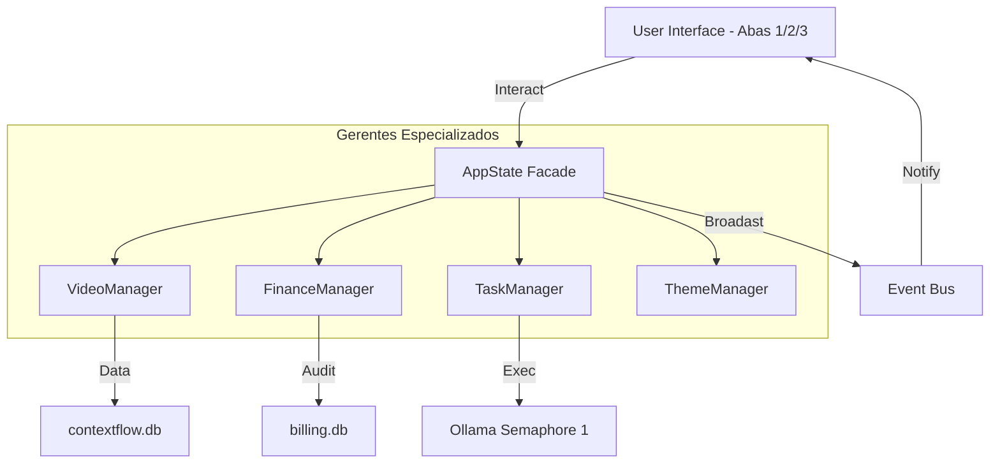

# ARCHITECTURE: A Lei da Estabilidade (Maturidade Industrial)

> **Versão:** 1.2 (Consolidado Phase 6.0 - Muro de Arrimo)
> **Princípio Mestre:** Estabilidade Operacional > Features Complexas.
> **Status:** BLINDADO (Núcleo Fragmentado em Gerentes)

## ⚠️ INTERDIÇÃO TÉCNICA E SEGURANÇA
*   **EXTINÇÃO DEFINITIVA:** O arquivo `ui/panel_grid.py` foi removido fisicamente. Sua restauração é terminantemente proibida para manter a pureza da Grid Virtual.
*   **LIGHT MODE ABSOLUTO:** O padrão visual imutável é o Fundo Branco (#FFFFFF) com Texto Escuro, gerido centralizadamente pelo `ThemeManager`.
*   **MISSÃO:** Operação exclusiva via **Topologia de 3 Abas Independentes** sob o **Protocolo Zero-Knowledge**.

## 1. Topologia Oficial (Trindade de Isolamento)
O sistema é estruturado em três entidades físicas e lógicas que não se conhecem (Zero-Knowledge):

1.  **Aba 1 (Doca de Carga):** `ui/tab_batch.py`. Ingestão massiva e feedback de fila.
2.  **Aba 2 (Cockpit Analítico):** `ui/tab_analysis.py`. Centro de triagem Master-Detail utilizando `VirtualVideoTable`.
3.  **Aba 3 (Leitura Imersiva):** `ui/panel_detail.py`. Visualização de conteúdo e insights de IA.

## 2. Padrão de Projeto: A Fachada de Delegação (Facade)

O núcleo foi fragmentado para evitar a "God Class" `AppState`. Toda a inteligência reside em gerentes especializados:

*   **`VideoManager`**: Responsável exclusivo por CRUD de vídeos, metadados e cache de snapshot (Performance 10k).
*   **`FinanceManager`**: Gestor do **Cofre**. Controla o banco soberano `billing.db`.
*   **`TaskManager`**: Orquestrador de threads com **Semáforo de Hardware** (IA Local limitada a 1 worker).
*   **`ThemeManager`**: Fonte Única de Verdade para o design system Light Mode.

**Regra de Ouro:** A UI interage APENAS com a fachada `AppState`, que delega as chamadas aos gerentes. Nenhum componente de UI deve instanciar ou acessar os gerentes diretamente (Isolamento de Camadas).

### 2.1. Virtualização de UI (Sempre-Virtual)
A Grid no Cockpit Analítico (`ui/tab_analysis.py`) opera **exclusivamente** através de `ui/virtual_table.py`.
*   **Fonte de Verdade (SSoT):** `AppState`. Proibido armazenar dados de vídeos em variáveis de instância da UI.
*   **Performance:** Suporte nativo para 10.000+ itens com latência de scroll zero.

### 2.2. Barramento de Eventos (PubSub)
Toda comunicação inter-módulos é assíncrona e desacoplada.
*   **Core:** Publica eventos (ex: `VIDEO_PROMOTED`, `TASK_UPDATED`).
*   **UI:** Assina eventos e agenda updates via `wx.CallAfter`.
*   **Proibição:** É proibido que as abas importem classes ou acessem instâncias umas das outras.

### 2.3. Sincronia Atômica e Promoção
A transição de tarefas temporárias (`_active_downloads`) para registros persistentes (`_videos`) ocorre via **Promoção Atômica**, garantindo que não haja duplicação visual na Grid.

## 3. Fluxo de Dados e Dependências (SSoT)

## 4. Regras Pétreas (Auditoria de Integridade)
1.  **Isolamento Zero-Knowledge:** Sincronia 100% via `AppState` e `PubSub`.
2.  **Debouncing Mandatário:** Refresh da Grid na Aba 2 exige debounce de 250ms (Restart-on-Event).
3.  **Kill-Switch de Rede:** O mecanismo de cancelamento deve interromper threads de download e purgar dados incompletos da memória imediatamente.
4.  **O Cofre e O Escudo:** A infraestrutura de tokens e rotação de proxies é imutável e deve ser preservada em novas implementações.
5.  **Interdição de Legado:** Proibida a restauração de lógicas baseadas em `wx.grid.Grid` que não utilizem o modelo `VirtualTable`.

