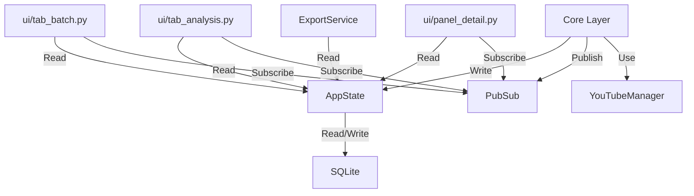

# ARCHITECTURE: A Lei da Estabilidade (AMV)

> **Princípio Mestre:** Estabilidade Operacional > Features Complexas.
> **Módulo Crítico:** `ui/tab_analysis.py`
> **Status:** Em Implementação (Consolidação Estrutural)

## ⚠️ INTERDIÇÃO TÉCNICA E SEGURANÇA
*   **ALVO DE DEMOLIÇÃO:** `ui/panel_grid.py`. Este arquivo está **TERMINANTEMENTE INTERDITADO**. Qualquer tentativa de importá-lo ou ler seu conteúdo resultará em erro de auditoria. Ele deve ser tratado como **inexistente** para todas as novas lógicas de implementação.
*   **MISSÃO:** Operação exclusiva via **Topologia de 3 Abas Independentes**.

## 1. Topologia Oficial (Trindade de Isolamento)
O sistema é estruturado em três entidades físicas e lógicas que não se conhecem (Zero-Knowledge):

1.  **Aba 1 (Doca de Carga):** `ui/tab_batch.py`. Exclusiva para ingestão massiva e feedback de fila.
2.  **Aba 2 (Cockpit Analítico):** `ui/tab_analysis.py`. Centro de triagem Master-Detail utilizando `VirtualVideoTable`.
3.  **Aba 3 (Leitura Imersiva):** `ui/panel_detail.py`. Visualização de conteúdo bruto sem distrações de grid.

### Roadmap de Consolidação
| Fase | Prioridade | Principais Entregas |
|------|------------|---------------------|
| **5.7** | CRÍTICA | Segregação Tática: Purga de Legado, Virtualização Total e Isolamento Zero-Knowledge das Abas. |
| **Estabilização**| Alta | Validação da Suite de Testes e Performance Stress Test |

## 2. Padrões Arquiteturais Mandatários

### 2.1. Virtualização de UI (Sempre-Virtual)
A Grid no Cockpit Analítico (`ui/tab_analysis.py`) opera **exclusivamente** através de `ui/virtual_table.py`.
*   **Fonte de Verdade:** `AppState`. Nunca armazene dados de vídeos em variáveis de instância da UI.
*   **Performance:** Latência zero para 10.000+ itens.

### 2.2. Barramento de Eventos (PubSub)
Toda comunicação inter-módulos é assíncrona e desacoplada.
*   **Core:** Publica eventos (ex: `VIDEO_DONE`).
*   **UI:** Assina eventos e agenda updates via `wx.CallAfter`.
*   **Proibição:** É proibido que as abas importem classes umas das outras.

## 3. Fluxo de Dados e Dependências (SSoT)

### Grafo de Dependências Saneado

## 4. Regras Pétreas (Auditoria de Integridade)
1.  **Isolamento Zero-Knowledge:** Abas 1, 2 e 3 não possuem referências diretas. Sincronia 100% via `AppState`.
2.  **Debouncing Mandatário:** Refresh da Grid na Aba 2 exige debounce de 250ms acumulativos (Timer Restart-on-Event).
3.  **Prioridade de CPU:** Processamento de Ingestão (Aba 1) tem prioridade absoluta sobre a renderização da Aba 2.
4.  **Proibição de IA (Fase 6):** Qualquer referência a "Insights", "Resumos Automáticos" ou "IA" em Blueprints é nula até a validação física da Fase 5.7.
5.  **Interdição de Legado:** O arquivo `ui/panel_grid.py` é considerado inexistente. O sistema RECUSA qualquer importação vinda dele.

