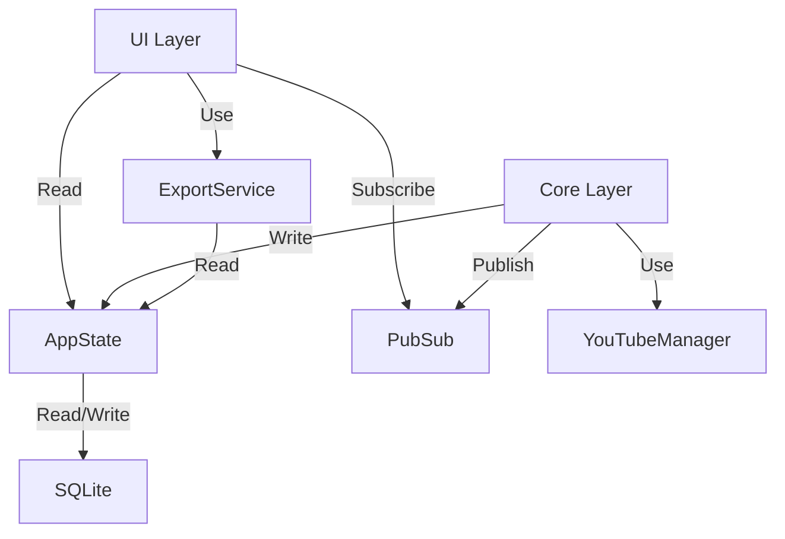

# ARCHITECTURE: A Lei da Estabilidade (AMV)

> **Princípio Mestre:** Estabilidade Operacional > Features Complexas.
> **Status:** Atualizado Pós-Fase 5.5 (Monolito Zero) e Fase 6 (Insights).

## 1. Padrões Arquiteturais Ativos

### 1.1. Virtualização de UI (VirtualTable)
A Grid (`panel_grid.py`) agora opera **exclusivamente** em modo virtual.
*   **Fonte de Verdade:** `AppState`. A Grid não possui estado próprio de dados.
*   **Mecanismo:** `VirtualVideoTable` (em `ui/virtual_table.py`) atua como proxy entre a `wx.Grid` e o `AppState`.
*   **Performance:** Capaz de renderizar 10.000+ itens com latência < 1ms (Validado).

### 1.2. Barramento de Eventos (PubSub)
O acoplamento direto entre Processamento e UI foi removido.
*   **Core (`processor.py`):** Não importa `wx`. Publica eventos via `core/pubsub.py`.
*   **UI (`panel_grid.py`):** Assina tópicos para fornecer feedback visual.
*   **Fluxo:** Unidirecional (Core -> PubSub -> UI).

### 1.3. Serviços Isolados
Lógica de negócios pesada é extraída para serviços puros.
*   **ExportService:** Gerencia I/O de arquivos (ZIP/MD). Independente da UI.
*   **YouTubeManager:** Isola complexidade do `yt-dlp`.

## 2. Fluxo de Dados e Dependências

### Grafo de Dependências Permitido

### Regras de Ouro (Linter Mental)
1.  **Processor NUNCA importa wx.** (Violação = Rollback imediato).
2.  **Grid NUNCA gerencia linhas manualmente.** (Use `VirtualTable`).
3.  **AppState é Singleton.** Única fonte de verdade para dados de vídeos.

## 3. Estado e Persistência

### AppState
*   Mantém cache em memória de todos os vídeos.
*   `get_all_videos()` retorna cópia segura (Snapshot) para renderização.
*   Escritas são protegidas por `RLock`.

### Banco de Dados
*   SQLite para persistência entre sessões.
*   Transcrições (BLOBs de texto) separadas de metadados para performance de listagem.

## 4. Próximos Passos (Evolução)
*   **Plugin IA:** Deve seguir padrão Service (AIService), falhando silenciosamente se indisponível.
*   **Leitura:** UI de leitura deve consumir AppState diretamente.

## 5. Arquitetura Fase 6 (Insights & IA)

### 5.1. Padrão Strategy para IA
*   **Interface:** `AIService` define o contrato `generate_summary(text)`.
*   **Implementações:** 
    *   `OpenAIProvider`: Conecta via API (custo por token).
    *   `OllamaProvider`: Conecta em `localhost` (custo zero, mais lento).
*   **Seleção:** Dinâmica baseada em `config.json`.

### 5.2. Master-Detail Interno
*   A Aba 2 (`GridPanel`) evolui para conter um `wx.SplitterWindow`.
*   **Grid (Master):** Mantém a `VirtualTable` no topo.
*   **Detail (Slave):** Novo painel de resumo na base, instanciado sob demanda.
