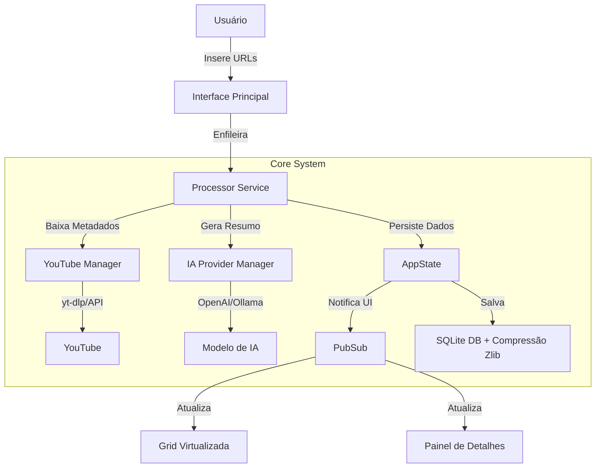
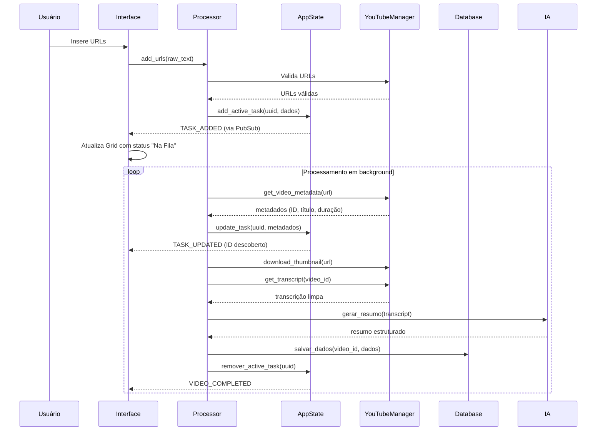

# PRD: ContextFlow - Transformador de Conteúdo de Vídeo para Análise Inteligente

> **Versão:** 1.0  
> **Data:** 25 de janeiro de 2026  
> **Status:** Documentação Viva e Evolutiva  
> **Proprietário:** Equipe de Desenvolvimento ContextFlow

## 1. Visão Geral do Produto

### Identidade do Produto
- **Nome Oficial:** ContextFlow  
- **Versão Atual:** 1.0 (Pré-lançamento)  
- **Slogan:** "Transforme vídeos do YouTube em insights acionáveis em segundos."  
- **Missão:** Simplificar a extração, limpeza e análise de conteúdo de vídeo para analistas que precisam sintetizar grandes volumes de informações rapidamente.

### Personas Principais (Foco Estratégico no Analista)
| Persona | Nome | Dor Principal | Trabalho a ser Feito |
|---------|------|---------------|----------------------|
| **O Analista** | Ana | Precisa analisar centenas de vídeos para extrair insights sem perder tempo assistindo conteúdo | "Transformar horas de conteúdo em resumos estruturados que permitam identificação rápida de padrões e tendências" |
| **O Arquivista** | Marcos | Precisa coletar e armazenar grandes volumes de conteúdo com confiabilidade | "Criar uma base de dados offline de conteúdo para consulta futura" |

**Diferenciais Estratégicos:**
- **Foco no Analista:** Prioriza interface Master-Detail com resumos instantâneos e filtros inteligentes
- **Performance Extrema:** Virtualização de Grid permite navegação fluida com +10.000 vídeos
- **Custo-Eficiência:** Resumos sob demanda evitam processamento desnecessário de IA
- **Experiência de Usuário Profissional:** Interface estilo planilha com drag-and-drop, ordenação e expansão de células

**Decisão Estratégica:** O ContextFlow focará PRIMARIAMENTE no perfil **Analista**, entregando uma experiência de triagem e análise rápida. Funcionalidades de arquivamento serão mantidas como secundárias.

## 2. Arquitetura de Alto Nível e Escolhas Tecnológicas

### Fluxo de Dados Principal


### Stack Tecnológico
| Tecnologia | Versão | Por que foi Escolhida | Alternativas Consideradas |
|------------|--------|------------------------|----------------------------|
| **Python** | 3.11+ | Ecossistema maduro para processamento de dados e IA | Node.js (menos bibliotecas científicas) |
| **wxPython** | 4.2.0 | Componentes nativos do OS, performance superior para grids complexas | Electron (consumo alto de RAM), PyQt (curva de aprendizado mais íngreme) |
| **SQLite3** | 3.37+ | Zero configuração, arquivo único, perfeito para apps desktop single-user | PostgreSQL (complexidade desnecessária para este caso) |
| **yt-dlp** | 2023+ | Mais robusto e atualizado para engenharia reversa do YouTube | youtube-dl (descontinuado) |
| **PubSub** | wx.lib.pubsub | Desacoplamento completo entre UI e lógica de negócios | Callbacks diretos (acoplamento excessivo) |
| **Tiktoken** | 0.5.1+ | Contagem precisa de tokens para modelos OpenAI | Contagem por bytes (imprecisa) |

### Padrões de Arquitetura
- **Single Source of Truth:** AppState como único local de estado da aplicação
- **Observer Pattern:** PubSub para notificações entre componentes
- **Virtualization:** Renderização sob demanda para Grid
- **Repository Pattern:** Isolamento de persistência através do DatabaseHandler
- **Strategy Pattern:** Suporte a múltiplos provedores de IA

## 3. Árvore de Diretórios e Esqueleto do Projeto

```
contextflow/
├── docs/                     # Documentação viva e evolutiva
│   ├── ARCHITECTURE.md       # Explicação da arquitetura atual
│   ├── STRATEGY.md           # Decisão estratégica (foco no analista)
│   ├── DECISIONS/            # ADRs (Architectural Decision Records)
│   │   └── YYYY-MM-DD-descricao.md  # Registros de decisões importantes
│   └── USER_STORIES/         # Histórias de usuário priorizadas
├── core/                     # Lógica de negócios e processamento
│   ├── app_state.py          # AppState - fonte única da verdade
│   ├── processor.py          # Orquestração de tarefas
│   ├── token_engine.py       # Contagem de tokens para IA
│   └── export_formatter.py   # Formatação de exportações
├── services/                 # Integrações externas
│   ├── youtube_manager.py    # Comunicação com YouTube
│   └── ia_providers/         # Abstração para provedores de IA
├── storage/                  # Persistência de dados
│   └── db_handler.py         # Camada de acesso ao banco
├── ui/                       # Interface do usuário
│   ├── app_window.py         # Janela principal
│   ├── sidebar.py            # Navegação lateral
│   ├── panels/               # Componentes de interface
│   │   ├── grid_panel.py     # Grid virtualizada com Master-Detail
│   │   └── detail_panel.py   # Visualização de conteúdo
│   └── styles.py             # Gerenciamento de temas
├── data/                     # Dados gerados em runtime
│   ├── contextflow.db        # Banco de dados principal
│   └── thumbs/               # Cache de thumbnails
├── tests/                    # Testes automatizados
├── KANBAN.md                 # Status atual do desenvolvimento
├── ROADMAP.md                # Visão de longo prazo
├── CHANGELOG.md              # Registro de mudanças por versão
└── main.py                   # Ponto de entrada da aplicação
```

## 4. Requisitos Funcionais (RFs)

### RF-001: Inserção e Processamento de URLs
- **Ação do Usuário:** Usuário cola URLs de vídeos ou playlists na área de input
- **Fluxo de Código:** 
  1. UI captura texto na `BatchPanel`
  2. `Processor.add_urls()` valida URLs e expande playlists
  3. Tarefas são enfileiradas com UUID temporário
  4. `AppState` notifica UI via PubSub para atualizar visualmente
- **Módulo Crítico:** `core/processor.py` (linhas 45-120)
- **Status:** Implementado (V2.3)

### RF-002: Interface Master-Detail e Configurações
- **Ação do Usuário:** 
  1. Seleciona vídeo na Grid para ver detalhes (Master-Detail).
  2. Acessa menu para configurar provedor de IA e comportamento da interface.
- **Fluxo de Código:**
  1. Evento `EVT_GRID_SELECT_CELL` dispara expansão do Painel de Detalhes (se configurado como 'Adaptativo').
  2. `SettingsDialog` permite alterar entre OpenAI/Ollama e definir API Keys sem reiniciar.
  3. `AppState` persiste preferências em `config.json` e notifica componentes via `PREFS_CHANGED`.
- **Módulo Crítico:** `ui/panels/grid_panel.py` e `ui/dialogs/settings_dialog.py`
- **Status:** Planejado (Fase 6)

### RF-003: Resumo de Conteúdo sob Demanda
- **Ação do Usuário:** Clica em "Gerar Resumo" ou checkbox de resumo individual
- **Fluxo de Código:**
  1. UI dispara evento `REQUEST_SUMMARY` via PubSub
  2. `IAProviderManager` seleciona provedor configurado
  3. Processamento ocorre em thread separada
  4. Resultado salvo no banco e notificação via `SUMMARY_READY`
- **Módulo Crítico:** `services/ia_providers/base_provider.py`
- **Status:** Em implementação (Fase 5.5)

### RF-004: Filtros Inteligentes por Tags
- **Ação do Usuário:** Seleciona tags na interface para filtrar vídeos
- **Fluxo de Código:**
  1. UI captura seleção de tags
  2. `AppState` filtra vídeos em memória
  3. Grid atualiza visualmente sem recarregar do banco
  4. Sistema aprende preferências do usuário para futuras sessões
- **Módulo Crítico:** `core/app_state.py` (método `filter_by_tags`)
- **Status:** Planejado (Fase 8)

### RF-005: Exportação Inteligente
- **Ação do Usuário:** Seleciona vídeos e escolhe formato de exportação
- **Fluxo de Código:**
  1. UI captura seleção e formato desejado
  2. `ExportManager` processa em streaming (não carrega tudo na RAM)
  3. Barra de progresso atualizada via thread segura
  4. Arquivo salvo e notificação enviada
- **Módulo Crítico:** `core/export_manager.py`
- **Status:** Parcialmente implementado (Fase 4)

## 5. Requisitos Não Funcionais (RNFs)

### Performance
| Métrica | Alvo | Medição |
|---------|------|---------|
| **Tempo de Carregamento** | < 2s para 1.000 vídeos | Inicialização da aplicação |
| **Navegação na Grid** | < 100ms de latência | Movimento do mouse/teclado |
| **Geração de Resumo** | < 15s por vídeo (GPT-4o) | Tempo fim-a-fim |
| **Uso de RAM** | < 150MB com 5.000 vídeos | Processo principal |
| **Resposta a Eventos** | < 50ms | Clique em botões/filtros |

### Segurança
- **Rate Limiting:** Jitter aleatório entre requisições (2-5s) para evitar bloqueios
- **Tratamento de Erros:** Nenhum crash em falhas de rede ou YouTube
- **Proteção de Dados:** Banco de dados SQLite encriptado em versões futuras
- **Sanitização:** Todos os dados de entrada validados e limpos antes do processamento

### Usabilidade
- **Acessibilidade:** Suporte a leitores de tela e navegação por teclado
- **Internacionalização:** Suporte a múltiplos idiomas (inglês/português inicialmente)
- **Ergonomia Visual:** Contraste adequado para leitura prolongada
- **Feedback Imediato:** Progresso visual para todas as operações assíncronas

### Compatibilidade
- **Sistemas Operacionais:** Windows 10+, macOS 12+, Linux (Ubuntu 20.04+)
- **Python:** Versão 3.11 ou superior
- **Resolução:** Suporte a telas 1080p e superiores com layout responsivo

## 6. Análise Técnica Profunda

### 6.1. AppState: O Cérebro do Sistema
**O que é:** Singleton que gerencia o estado central da aplicação em memória.  
**Por que escolhemos:** Resolveu o problema crítico de concorrência onde deletar playlists fazia tarefas em andamento desaparecerem.  
**Como funciona:**
```python
class AppState:
    _instance = None
    _lock = threading.RLock()  # Para thread safety
    
    def __init__(self):
        self._videos = {}  # ID -> dados completos
        self._active_tasks = {}  # UUID -> dados temporários
        self._observers = []  # Para notificações via PubSub
```
**Riscos Mitigados:**  
- Race conditions com `threading.RLock()`
- Perda de dados com persistência assíncrona
- UI travando com notificações via `wx.CallAfter`

### 6.2. Virtualização da Grid
**O que é:** Técnica de renderização que carrega apenas dados visíveis na tela.  
**Por que escolhemos:** Grid tradicional travava com >100 vídeos.  
**Como funciona:**
```python
class VirtualTable(wx.grid.PyGridTableBase):
    def GetValue(self, row, col):
        # Só carrega dados quando realmente necessários para renderização
        video_id = self.row_data[row]
        return self.app_state.get_video_field(video_id, col)
```
**Benefícios:**  
- Performance constante independentemente do volume de dados
- Memória otimizada com carregamento sob demanda
- Experiência de usuário fluida mesmo com 10.000+ vídeos

## 7. Mapeamento Mestre de Componentes Críticos

### Componente: GridPanel com Master-Detail
| Atributo | Detalhe |
|----------|---------|
| **Quem usa** | Analistas de conteúdo, pesquisadores |
| **Pra quê** | Triagem rápida de vídeos e visualização imediata de resumos |
| **Quando roda** | Ao selecionar vídeo na grid principal |
| **Lógica de Negócio** | 1. Usuário seleciona vídeo na Grid<br>2. Sistema verifica se vídeo tem resumo<br>3. Se tiver, expansão automática do painel inferior<br>4. Se não tiver, painel permanece recolhido |
| **Tratamento de Falhas** | Se falhar carregamento, exibe mensagem "Erro ao carregar conteúdo" |
| **Arquivo/linha** | `ui/panels/grid_panel.py` (linhas 380-450) |
| **Exemplo de Uso** | ```python\n# Lógica de expansão automática\nif video_data.get('has_summary'):\n    self.splitter.SetSashPosition(300)\nelse:\n    self.splitter.SetSashPosition(0)  # Painel oculto\n``` |

### Componente: IAProviderManager
| Atributo | Detalhe |
|----------|---------|
| **Quem usa** | Sistema de resumo automático |
| **Pra quê** | Gerar resumos inteligentes do conteúdo dos vídeos |
| **Quando roda** | Quando usuário solicita resumo ou em lotes selecionados |
| **Lógica de Negócio** | 1. Verifica configuração do usuário<br>2. Seleciona provedor (OpenAI ou Ollama local)<br>3. Prepara prompt com contexto específico<br>4. Executa chamada API com timeout<br>5. Processa resposta e salva no banco |
| **Tratamento de Falhas** | Timeout de 60s, fallback para resumo básico se falhar |
| **Arquivo/linha** | `services/ia_providers/manager.py` |
| **Schema de Prompt** | ```json\n{\n  "model": "gpt-4o",\n  "messages": [\n    {\n      "role": "system",\n      "content": "Você é um analista especializado em conteúdo de vídeo. Resuma de forma concisa e identifique pontos-chave, produtos mencionados e conclusões."\n    },\n    {\n      "role": "user",\n      "content": "{transcription}"\n    }\n  ]\n}\n``` |

## 8. Pipeline de Processamento de Vídeo

### Ciclo de Vida Completo


## 9. Integrações Externas

### YouTube (Acesso Não Oficial)
- **Configuração:** Nenhuma chave necessária, usa engenharia reversa do player web
- **Limitações:** Sujeito a bloqueios por IP com alta frequência
- **Mitigação:** Jitter aleatório entre requisições e uso de cookies do navegador
- **Variáveis de Ambiente:** 
  - `YOUTUBE_COOKIES_PATH`: Caminho para arquivo de cookies do Chrome

### Provedores de IA
- **OpenAI API:**
  - Variáveis necessárias: `OPENAI_API_KEY`
  - Modelo padrão: `gpt-4o`
  - Limite de tokens: 128k
- **Ollama (Local):**
  - Necessário instalar Ollama separadamente
  - Modelo recomendado: `phi3:medium`
  - Endpoint: `http://localhost:11434/api/generate`

## 10. Segurança e Autenticação

### Proteção contra Bloqueio
- **Anti-Bloqueio com Cookies:** Utiliza cookies do navegador Chrome para autenticar como usuário real
  ```python
  def get_browser_cookies():
      from yt_dlp.cookies import cookies_from_browser
      return cookies_from_browser('chrome')
  ```
- **Jitter Aleatório:** Pausa entre 2-5 segundos após cada vídeo processado
- **Fallbacks:** Tenta múltiplos métodos de obtenção de transcrição

### Segurança de Dados
- **Transcrições:** Dados sensíveis são comprimidos com zlib antes de salvar no banco
- **Configurações:** Preferências de usuário salvas em `config.json` na pasta de dados
- **Exportação:** Arquivos exportados nunca contêm credenciais ou dados sensíveis

## 11. Infraestrutura e DevOps

### Requisitos Mínimos
| Componente | Especificação |
|------------|---------------|
| **Processador** | Dual-core 2.0GHz+ |
| **Memória RAM** | 4GB (8GB recomendados para >1.000 vídeos) |
| **Armazenamento** | 100MB para instalação + espaço para dados |
| **Sistema Operacional** | Windows 10+, macOS 12+, Linux (Ubuntu 20.04+) |
| **Conexão Internet** | 10Mbps para downloads rápidos |

### Variáveis de Ambiente (`.env`)
```env
# Obrigatórias para funcionalidade básica
DATA_DIR=./data
DB_PATH=./data/contextflow.db

# Opcionais para IA
OPENAI_API_KEY=sua_chave_aqui
OLLAMA_ENDPOINT=http://localhost:11434

# Avançadas
MAX_CONCURRENT_DOWNLOADS=3
YOUTUBE_COOKIES_PATH=/path/to/chrome/cookies
```

## 12. Extensibilidade e Customização

### Arquitetura de Plugins
O sistema suporta plugins para:
- Novos provedores de IA
- Formatos de exportação personalizados
- Filtros de transcrição especializados

### Como Criar um Plugin de IA (Exemplo)
1. Crie arquivo `services/ia_providers/custom_provider.py`
2. Implemente interface base:
```python
from services.ia_providers.base_provider import BaseProvider

class CustomProvider(BaseProvider):
    def generate_summary(self, transcript: str) -> str:
        """Implementação personalizada do resumo"""
        # Sua lógica aqui
        return summary
```
3. Registre o provedor em `services/ia_providers/__init__.py`
4. Configure no arquivo `config.json`

## 13. Limitações Conhecidas

### Limitações Técnicas
1. **Bloqueio do YouTube:** Se processar mais de 50 vídeos em 10 minutos, pode sofrer bloqueio temporário
2. **Transcrições em Outros Idiomas:** Qualidade do resumo depende da qualidade da transcrição original
3. **Performance em Máquinas Antigas:** Interface pode ficar lenta com <4GB de RAM e milhares de vídeos
4. **Vídeos com Restrição de Idade:** Alguns vídeos podem precisar de autenticação para acessar transcrições

### Workarounds Sugeridos
- **Para Bloqueio:** Use cookies do navegador e limite a 20 vídeos por sessão
- **Para Restrição de Idade:** Configure cookies autenticados do Chrome
- **Para Performance:** Aumente memória do sistema ou reduza número de vídeos carregados simultaneamente

## 14. Roadmap Inferido

### Fases Imediatas (0-3 meses)
| Fase | Prioridade | Principais Entregas |
|------|------------|---------------------|
| **5.5** | Alta | Refatoração de performance: Virtualização da Grid, PubSub completo, compressão de transcrições |
| **6** | Crítica | Interface Master-Detail, resumos inteligentes, filtros por tags |
| **7** | Média-Alta | Dark Mode, persistência de preferências, visualização de imagens expandidas |
| **8** | Média | Busca avançada em transcrições, visualização de dados (nuvem de palavras) |

### Fases Futuras (3-12 meses)
| Meta | Descrição | Impacto |
|------|-----------|---------|
| **Scanner Local** | Processar arquivos locais (PDF, TXT) além de vídeos | Aumenta cases de uso em 5x |
| **Integração com NotebookLM** | Exportar diretamente para ambientes de IA | Fluxo de trabalho contínuo |
| **Busca Semântica** | Encontrar vídeos por significado, não só palavras-chave | Diferencial competitivo |
| **Time Machine** | Visualizar como o conteúdo de um canal evoluiu ao longo do tempo | Valor único para pesquisadores |

## 15. Guia MESTRE de Replicação (Do Zero)

### Passo 1: Pré-requisitos
```bash
# Python (versão exata)
python --version  # Deve ser 3.11 ou superior

# Bibliotecas do sistema
# Windows: Nenhuma adicional
# macOS: xcode-select --install
# Linux (Ubuntu): sudo apt-get install python3-dev ffmpeg libgl1
```

### Passo 2: Configuração do Ambiente
```bash
# 1. Clone o repositório
git clone https://github.com/seuusuario/contextflow.git 
cd contextflow

# 2. Crie ambiente virtual
python -m venv venv

# 3. Ative o ambiente (Windows)
venv\Scripts\activate
# ou (Linux/Mac)
# source venv/bin/activate

# 4. Instale dependências
pip install -r requirements.txt
```

### Passo 3: Arquivo de Requisitos (`requirements.txt`)
```
wxPython>=4.2.0
yt-dlp>=2023.03.04
youtube-transcript-api>=0.6.0
tiktoken>=0.5.1
requests>=2.28.0
Pillow>=9.4.0
python-dotenv>=1.0.0
```

### Passo 4: Configuração Inicial
```bash
# 1. Crie pasta de dados
mkdir -p data/thumbs

# 2. Configure variáveis de ambiente (opcional para IA)
echo "OPENAI_API_KEY=sua_chave_aqui" > .env

# 3. Execute a aplicação
python main.py
```

### Passo 5: Teste de Fumaça
1. **Abertura:** Aplicação abre maximizada com Dark Theme
2. **Funcionalidade Básica:** 
   - Vá para aba "Dados"
   - Cole URL de teste: `https://www.youtube.com/watch?v=dQw4w9WgXcQ `
   - Clique em "Processar Fila"
3. **Visualização:** 
   - Após processamento, vídeo aparece na Grid
   - Clique no vídeo para ver transcrição na aba "Conteúdo"
4. **Exportação:**
   - Selecione o vídeo na Grid
   - Clique em "Exportar Selecionados (ZIP)"
   - Verifique arquivo exportado

### Passo 6: Ambiente de Desenvolvimento
```bash
# Estrutura recomendada para contribuir
contextflow/
├── .vscode/                 # Configurações do VSCode
│   ├── settings.json        # Formatação automática
│   └── launch.json          # Debug configurations
├── dev-requirements.txt     # Dependências de desenvolvimento
└── scripts/                 # Scripts utilitários
    ├── migrate_db.py        # Migrações de banco
    └── generate_docs.py     # Atualização automática de docs
```

### Passo 7: Contribuindo com o Projeto
1. **Padrão de Commits:** Use Conventional Commits
   - `feat:` para novas funcionalidades
   - `fix:` para correções de bugs
   - `docs:` para atualizações de documentação
   - `refactor:` para mudanças de código sem alterar comportamento

2. **Pull Requests:** Todo PR deve:
   - Atualizar documentação relevante
   - Incluir testes para nova funcionalidade
   - Seguir convenções de código existentes

3. **Versionamento:** 
   - Versões semver após v1.0
   - Branches por feature: `feature/nome-da-feature`
   - Branch principal: `main`

---

Este PRD é um **documento vivo** que evolui com o projeto. Ele substitui arquivos de configuração complexos e comentários espalhados pelo código, centralizando todo o conhecimento necessário para entender, manter e evoluir o ContextFlow.

**Próximos passos recomendados:**
1. Implementar Fase 5.5 conforme o plano detalhado
2. Atualizar este documento conforme novas descobertas e decisões
3. Criar um sistema de alertas para quando este documento divergir do código

*Este documento foi gerado pensando em ser 100% replicável por qualquer desenvolvedor, mesmo sem conhecimento prévio do projeto. Ele representa a visão consolidada de como o ContextFlow DEVE SER, não apenas como está atualmente.*