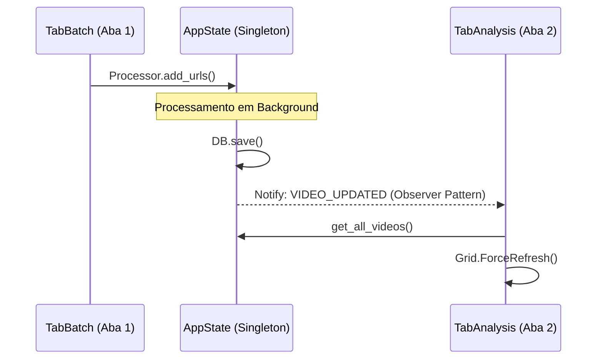

# PHASE 5.7 CONTRACTS (Comunicação Desacoplada)

## 1. Camada de Abstração: AppState
As novas abas (`TabBatch` e `TabAnalysis`) não devem se comunicar diretamente entre si. Todo o fluxo de informação deve passar pelo `core/app_state.py`.

## 2. Contratos de PubSub

### 2.1. Da TabBatch para o Sistema
*   `TASK_QUEUED`: Notifica que novas tarefas foram enfileiradas.
*   `TASK_PROGRESS`: Atualiza o label de status na `TabBatch` sem afetar a Grid da `TabAnalysis` até que o dado seja persistido.

### 2.2. Do Sistema para a TabAnalysis
*   `VIDEO_UPDATED` / `TASK_COMPLETED`: Gatilhos para a `TabAnalysis` disparar um `refresh_table()`.
*   `VIDEOS_DELETED`: Gatilho para remoção cirúrgica de itens da Grid Virtual.

## 3. Sincronização Automática

Este contrato garante que a Aba 2 esteja sempre atualizada, mesmo que o usuário nunca saia da Aba 1 durante sessões de importação em lote.
