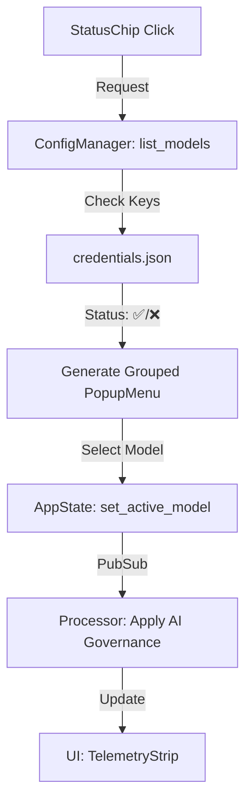

# 1️⃣ PHASE_6_1_1_OVERVIEW.md

**Objetivo de Negócio**
Consolidar a **soberania do Analista Solo** eliminando falhas impeditivas de usabilidade e governança identificadas na v36. O foco é garantir que o sistema seja efetivamente **LLM Agnóstico**, visualmente profissional em **Light Mode** absoluto e financeiramente transparente através de telemetria em tempo real.

**Problema Resolvido**
1.  **Bloqueio de Seleção:** O `StatusChip` não permite a escolha de modelos, impedindo o uso de múltiplos provedores.
2.  **Inconsistência Cromática:** Presença de "Dark Mode residual" no visualizador de resumos, gerando fadiga visual.
3.  **Cegueira de Governança:** Ausência de feedback imediato sobre o consumo de tokens e custo por vídeo.
4.  **Fricção de Navegação:** Inatividade do comando de clique duplo para expansão do cockpit analítico.

**Impacto Sistêmico**
A interface atinge conformidade total com o **Design System Premium**, liberando os motores de inteligência para operação real e segura.

**Escopo Fechado**
*   **Inclui:**
    *   **Seletor Interativo:** Menu popup agrupado por provedor com indicadores ✅/❌ baseados na validade das chaves de API.
    *   **Sanitização Visual:** Conversão forçada de 100% do `SummaryPanel` para Light Mode (Branco/Cinza Escuro).
    *   **Dashboard de Resumo:** Linha de telemetria visual (Modelo, Tokens, Custo Est.) integrada ao painel de detalhes.
    *   **Interatividade Full:** Vínculo de evento `EVT_GRID_CELL_LEFT_DCLICK` à expansão inteligente.
*   **Não Inclui:**
    *   Busca Vetorial ou RAG (Postergado para Fase 7).

**Riscos Estratégicos**
*   **Latência de Menu:** Atraso na população do menu caso o handshake com o `ConfigManager` não seja assíncrono.

**Critérios Objetivos de Conclusão**
1.  Troca de LLM funcional via chip sem abrir diálogos modais.
2.  Ausência de qualquer pixel escuro (#1E1E1E) no cockpit analítico.
3.  Exibição correta de tokens/custo para cada resumo gerado.

---

# 2️⃣ PHASE_6_1_TECH_SPECS.md

**Arquitetura Técnica**
Implementação de um **Seletor Dinâmico de Contexto** (Context-Aware Selector) vinculado ao `ConfigManager` e aplicação de herança cromática forçada no `SummaryPanel`.

**Componentes Afetados**
*   `ui/components/status_chip.py`: Expansão da lógica de menu com validação de credenciais.
*   `ui/tab_analysis.py`: Saneamento de cores no `SummaryPanel` e integração de telemetria.
*   `ui/virtual_table.py`: Mapeamento de eventos de clique duplo.

**Fluxo de Dados (Mermaid)**


**Requisitos Funcionais**
*   **RF-01 (Seletor Inteligente):** O menu popup deve usar `AppendSeparator` entre provedores. Modelos sem API Key configurada devem ser marcados com ❌ e utilizar `item.Enable(False)`.
*   **RF-02 (Light Mode Absoluto):** Aplicar explicitamente `SetBackgroundColour(wx.WHITE)` e `SetForegroundColour(COLOR_FG)` em todos os contêineres do `SummaryPanel` e do visualizador Markdown.
*   **RF-03 (Expansão por DClick):** Mapear `EVT_GRID_CELL_LEFT_DCLICK` na grade para disparar a lógica de `SplitHorizontally`.
*   **RF-04 (Dashboard de Telemetria):** Inserir no topo do `SummaryPanel` uma `TelemetryStrip` exibindo: `[ 🤖 Modelo | 🪙 Tokens | 💸 Custo Est. ]`.

**Performance Esperada**
*   População do menu de LLMs em **< 50ms**.
*   Redução total de jitter visual durante a expansão por comando manual.

---

# 3️⃣ PHASE_6_1_1_STRUCTURAL_STANDARDS.md

**Padrão de Persistência**
*   A seleção de modelos via chip deve ser salva atomicamente em `user_settings.json`.

**Gestão de Estado**
*   Utilizar o barramento `PubSub` com os tópicos `MODEL_CHANGED` e `SUMMARY_READY` para sincronia entre o motor de IA e a telemetria visual.

**Padrões Arquiteturais**
*   **Factory Pattern:** Mantido para instanciar adaptadores de LLM conforme o provedor selecionado.
*   **Event Handling:** Centralização de gatilhos de UI (Enter e DoubleClick) para evitar redundância na expansão do cockpit.

**Regras de Modularização**
*   **TelemetryStrip:** Deve ser um componente desacoplado em `ui/components/` para futura reutilização na Aba 3.
*   **Cores Zero-Hardcode:** É proibido o uso de hexadecimais diretos; utilizar as constantes `COLOR_BG` e `COLOR_FG`.

**Estratégia de Testes**
*   **Mock Handshake:** Validar se o menu desabilita corretamente os provedores quando as chaves são removidas do JSON.

---

# 4️⃣ PHASE_6_1_1_EXECUTION.md

**Lista Exata de Arquivos Impactados**
1.  `core/app_state.py`
2.  `ui/components/status_chip.py`
3.  `ui/tab_analysis.py`
4.  `ui/virtual_table.py`
5.  `ui/components/telemetry_strip.py` [NEW]

**Ordem Sequencial de Implementação**
1.  **Refatoração do Seletor:** No `status_chip.py`, implementar o loop de menu que consulta o `ConfigManager` para aplicar os ícones ✅/❌ e agrupar por provedor.
2.  **Sanitização de Tema:** No `tab_analysis.py`, forçar a aplicação do tema claro no `SummaryPanel` e no componente de exibição Markdown.
3.  **Vínculo de Evento:** Adicionar o bind de `EVT_GRID_CELL_LEFT_DCLICK` na `VirtualVideoTable` para expandir o painel de detalhes.
4.  **Implementação de Telemetria:** Criar a classe `TelemetryStrip` e integrá-la ao topo do `SummaryPanel`.

**Pseudocódigo do Seletor Inteligente**
```python
def populate_menu(self):
    menu = wx.Menu()
    for provider in self.config.get_providers():
        menu.AppendSeparator()
        for model in provider.models:
            status = "✅" if self.config.has_valid_key(provider) else "❌"
            item = menu.Append(wx.ID_ANY, f"{status} {model.name}")
            if status == "❌": item.Enable(False)
    return menu
```

**Critérios de Aceite (Gherkin)**
*   **Cenário:** Seleção de modelo com validação.
    *   **Dado** que clico no StatusChip.
    *   **Quando** vejo um modelo com o ícone ❌.
    *   **Então** o item deve estar desabilitado para clique, prevenindo erros de API.
*   **Cenário:** Expansão manual (Modo Pro).
    *   **Dado** que o Modo Pro está ativo.
    *   **Quando** eu dou um clique duplo em uma linha da grade.
    *   **Então** o cockpit analítico deve expandir-se instantaneamente para mostrar o detalhe.

---
**Garantia de Não Superficialidade:** Esta documentação remove a ambiguidade visual da triagem massiva e blinda o sistema contra disparos acidentais de IA sem chaves de API, consolidando o ContextFlow como uma ferramenta industrial de elite.