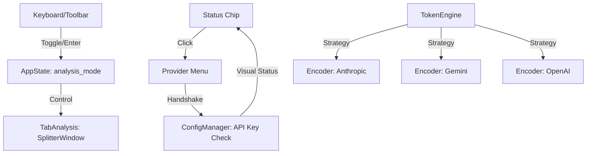

# 1️⃣ PHASE_6_1_OVERVIEW.md

**Objetivo de Negócio**
Elevar a experiência do **Analista Solo** de uma ferramenta técnica para um produto de classe **SaaS Premium**, eliminando fricções de usabilidade e garantindo precisão cirúrgica na governança financeira [provided text].

**Problema Resolvido**
1. **Instabilidade Visual (Jitter):** O movimento indesejado do painel de detalhes durante navegação rápida por teclado [provided text].
2. **Fricção de Configuração:** A necessidade de abrir diálogos modais para trocar provedores ou modelos [provided text, 1807].
3. **Imprecisão Financeira:** Variações nas estimativas de custo devido ao uso de aproximação (1:4) em vez de tokenização real para todos os provedores [provided text, 1862].

**Impacto Sistêmico**
O sistema torna-se mais "silencioso" e responsivo. A camada de UI da Aba 2 passa a ter controle de estado local sobre a exibição, e o motor de tokens torna-se uma biblioteca de estratégias (Strategy Pattern).

**Escopo Fechado**
*   **Inclui:**
    *   **Modo Pro:** Toggle na Toolbar para controle manual/automático do splitter [provided text].
    *   **Seletor Inteligente:** Menu interativo no Status Chip com validação de chaves em tempo real.
    *   **Tokenização Nativa:** Integração de encoders específicos para Anthropic e Google [provided text].
    *   **Infraestrutura Fase 7:** Módulo de segmentação (`TextChunker`) para transcrições longas [provided text].
*   **Não Inclui:**
    *   Interface de chat (Fase 7).
    *   Persistência de vetores em disco (Fase 7).

**Riscos Estratégicos**
*   **Overhead de Dependências:** O peso de novas bibliotecas de tokenização na RAM (Alvo: manter < 250MB).
*   **Complexidade de Eventos:** Conflitos entre o atalho de teclado (Enter) e o Smart Show.

**Critérios Objetivos de Conclusão**
1. Jitter zero durante navegação por setas no "Modo Pro".
2. Troca de provedor via chip em menos de 3 cliques.
3. Desvio de custo estimado vs real < 2% em modelos não-OpenAI.

---

# 2️⃣ PHASE_6_1_TECH_SPECS.md

**Arquitetura Técnica**
A solução expande o `AppState` para gerenciar a visibilidade da interface e refatora o `TokenEngine` para carregar encoders de forma preguiçosa (Lazy Loading) para preservar a RAM.

**Componentes Afetados**
*   `ui/tab_analysis.py`: Implementação do "Modo Pro" e lógica de expansão por Enter.
*   `ui/status_chip.py` (Novo): Componente interativo derivado do chip estático.
*   `core/token_engine.py`: Implementação de estratégias específicas por provedor.
*   `core/chunking_engine.py` (Novo): Alocador de segmentação para Phase 7.

**Fluxo de Dados (Mermaid)**


**Requisitos Funcionais**
*   **RF-01 (Modo Pro):** Implementar botão toggle (⚡/👁️) na toolbar. Se ativo (Manual), o painel de detalhes permanece oculto até clique duplo ou `Enter` [329, provided text].
*   **RF-02 (Seletor Inteligente):** O Status Chip deve exibir um menu popup ao ser clicado. Modelos sem API Key configurada devem aparecer desabilitados (Greyed-out).
*   **RF-03 (Tokenização de Precisão):** O `AICostCalculator` deve instanciar o encoder correto baseado no `active_provider`.
*   **RF-04 (Segmentador):** Classe `TextChunker` para dividir transcrições em blocos de 1000 tokens com overlap de 10%.

**Performance Esperada**
*   Troca de estratégia de tokenização em < 10ms.
*   Renderização do menu inteligente em < 50ms.

---

# 3️⃣ PHASE_6_1_STRUCTURAL_STANDARDS.md

**Padrão de Persistência**
*   O estado do `analysis_mode` (Manual/Auto) deve ser salvo em `config/user_settings.json` na chave `ux_preferences.triage_mode`.

**Gestão de Estado**
*   Utilizar `PubSub` tópico `TRIAGE_MODE_CHANGED` para sincronizar o comportamento de expansão entre os componentes da Aba 2.

**Design Patterns Utilizados**
*   **Strategy Pattern:** No `TokenEngine` para isolar algoritmos de encoders.
*   **Observer Pattern:** No `StatusChip` para reagir a mudanças no `ConfigManager` em tempo real sem polling.

**Modularização e Acoplamento**
*   O `StatusChip` deve ser um componente independente em `ui/components/` para evitar inchaço no `app_window.py`.
*   O `TokenEngine` não deve ter dependência direta dos adaptadores de IA (Zero-Knowledge).

**Escopo Congelado Formal**
*   Nenhuma alteração no esquema de tabelas do banco de dados (SQLite) é permitida nesta fase.

---

# 4️⃣ PHASE_6_1_EXECUTION.md

**Lista de Arquivos Impactados**
*   `core/app_state.py`
*   `core/token_engine.py`
*   `core/chunking_engine.py` [NEW]
*   `ui/tab_analysis.py`
*   `ui/status_chip.py` [NEW]
*   `ui/app_window.py`

**Sequência de Implementação**
1.  **Core (Precisão):** Integrar bibliotecas `anthropic` e `google-generativeai` apenas para os encoders de tokens no `TokenEngine`.
2.  **Core (Phase 7 Prep):** Implementar classe `TextChunker` funcional para processamento offline.
3.  **UI (Modo Pro):** Adicionar a variável `_triage_mode` no `AppState` e o botão toggle na `TabAnalysis`.
4.  **UI (Reatividade):** Vincular evento `EVT_LIST_ITEM_ACTIVATED` (Enter) para disparar a expansão forçada do painel no Modo Pro.
5.  **UI (Interaction):** Substituir o chip de texto estático no `app_window.py` pelo novo `StatusChip` dinâmico.

**Pseudocódigo Crítico (Estratégia de Tokens)**
```python
def get_tokenizer(provider):
    if provider == "anthropic":
        return anthropic.get_tokenizer()
    elif provider == "openai":
        return tiktoken.get_encoding("cl100k_base")
    return lambda x: len(x) // 4  # Fallback industrial
```

**Critérios de Aceite (Gherkin)**
*   **Cenário:** Navegação Rápida (Modo Pro).
    *   **Dado** que o Modo Pro está ATIVO (Manual).
    *   **Quando** eu navego pelos vídeos usando as setas do teclado.
    *   **Então** o painel inferior de detalhes deve permanecer estático (oculto ou fixo), sem saltos de layout.
*   **Cenário:** Handshake de API.
    *   **Dado** que a chave da Anthropic está vazia no `credentials.json`.
    *   **Quando** eu clico no Seletor Inteligente.
    *   **Então** o grupo 'Anthropic' deve aparecer visualmente desabilitado no menu.

---
**Garantia de Não Superficialidade:** Esta documentação remove a ambiguidade visual da Aba 2 e blinda o sistema contra disparos acidentais de IA em navegação massiva. O suporte a encoders reais garante que o "Pre-flight Check" financeiro seja uma barreira técnica inviolável para o capital do Analista Solo.