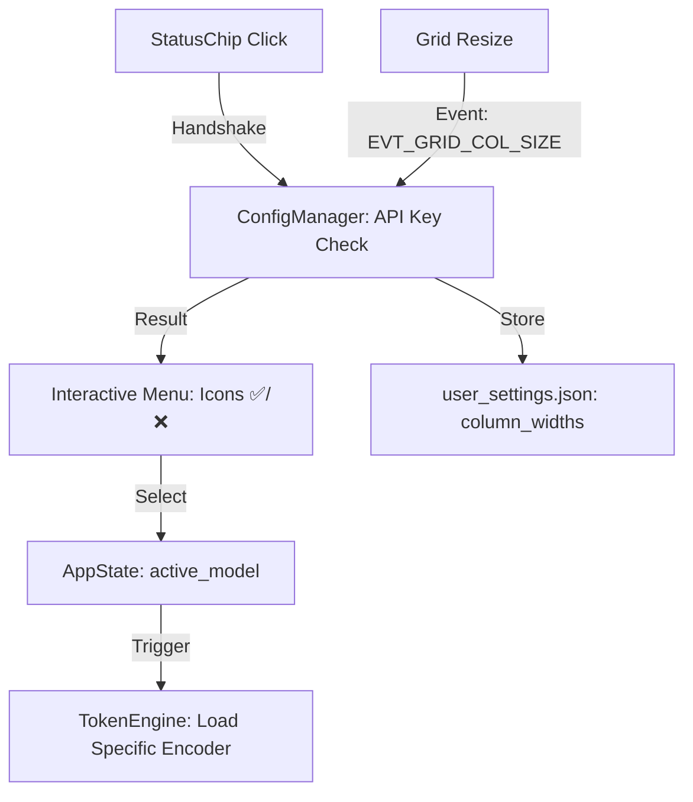

# 1️⃣ PHASE_6_1_OVERVIEW.md

**Objetivo de Negócio**
Elevar o **ContextFlow** ao padrão de **SaaS Premium**, transformando a ferramenta técnica em uma estação de trabalho analítica de elite para o **Analista Solo**. O foco é a eliminação total de atritos de interface, saneamento de visibilidade ("Os Invisíveis") e a garantia de soberania financeira com precisão cirúrgica de tokens [1823, provided text].

**Problema Resolvido**
1.  **Instabilidade de Layout (Jitter):** Expansão indesejada do painel de detalhes durante navegação massiva por teclado.
2.  **Cegueira Operacional (Invisíveis):** Botões de controle (Console/Sidebar) sem ícones ou camuflados no fundo branco [provided text, 1833].
3.  **Imprecisão de Custo:** Variações entre o custo estimado e o real devido ao uso de aproximação 1:4 para provedores não-OpenAI.
4.  **Desalinhamento Visual:** Células da grade com alinhamento inconsistente e vazamento de texto (overflow) [provided text].

**Impacto Sistêmico**
A camada de interface torna-se determinística e silenciosa. O motor de governança financeira torna-se **LLM Nativo** para todos os provedores e a persistência de layout garante que o cockpit mantenha a configuração de triagem personalizada pelo usuário entre sessões [1570, provided text].

**Escopo Fechado**
*   **Inclui:**
    *   **Modo Pro:** Botão na Toolbar para alternar entre expansão automática (Smart Show) e manual (Enter/Clique Duplo).
    *   **Seletor Inteligente:** Status Chip reativo com menu popup agrupado e validação visual de chaves (✅/❌).
    *   **Visibilidade Industrial:** Substituição de botões de texto por `wx.BitmapButton` de alto contraste [provided text].
    *   **Tokenização de Precisão:** Encoders reais para Anthropic e Google Gemini.
    *   **Persistência Elite:** Memorização de largura de colunas (Abas 1 e 2) e estado de maximização [provided text].
*   **Não Inclui:**
    *   Chat interativo ou busca vetorial (Fase 7).

**Riscos Estratégicos**
*   **Overhead de Dependências:** O carregamento de bibliotecas de tokenização pesadas (Google/Anthropic) pode elevar a RAM. (Mitigação: Lazy Loading).

**Critérios Objetivos de Conclusão**
1.  Jitter zero na navegação por setas no Modo Pro.
2.  Desvio de custo estimado vs real **< 2%** em todos os provedores.
3.  Todas as colunas centralizadas verticalmente e horizontalmente.
4.  Sistema inicia maximizado e em Light Mode 100% consistente [provided text, 1831].

---

# 2️⃣ PHASE_6_1_TECH_SPECS.md

**Arquitetura Técnica**
A solução utiliza o padrão **Strategy** para encoders de tokens e expande o `AppState` para gerenciar a persistência de preferências de UX. A interface utiliza `wx.BitmapButton` para garantir visibilidade em Light Mode [1575, provided text].

**Componentes Afetados**
*   `ui/app_window.py`: Relocalização do Modo Pro, Maximização e novos botões de Toggle.
*   `ui/virtual_table.py`: Implementação de persistência de colunas e alinhamento central global.
*   `ui/components/status_chip.py` [NEW]: Componente interativo para seleção de modelos.
*   `core/token_engine.py`: Refatoração para suporte a encoders nativos.

**Fluxo de Dados (Mermaid)**


**Requisitos Funcionais**
*   **RF-01 (Maximização):** Disparar `self.Maximize(True)` na inicialização da `AppWindow` [provided text].
*   **RF-02 (Centralização Global):** Aplicar `wx.ALIGN_CENTER` em todas as colunas da `VirtualVideoTable` via `GridCellAttr` [provided text].
*   **RF-03 (Seletor Inteligente):** O Status Chip deve exibir modelos agrupados por provedor; modelos sem chave no `credentials.json` devem disparar o `SettingsDialog` se selecionados [1831, provided text].
*   **RF-04 (Modo Pro):** Implementar botão toggle na Toolbar da Aba 2 que bloqueia o `SplitterWindow.SplitHorizontally` durante a navegação por setas.
*   **RF-05 (Saneamento de Visibilidade):** Toggles de Log e Sidebar devem utilizar ícones `(Bitmap)` visíveis sobre fundo branco [provided text].

**Performance Esperada**
*   Troca de provedor em runtime: **< 300ms**.
*   Carregamento de encoders nativos: **Lazy loading** ativado apenas no primeiro uso.

---

# 3️⃣ PHASE_6_1_STRUCTURAL_STANDARDS.md

**Padrão de Persistência**
*   Preferências de interface (`column_widths`, `triage_mode`, `last_model`) devem residir em `config/user_settings.json` [1575, provided text].

**Gestão de Estado**
*   Utilizar `PubSub` tópico `UX_LAYOUT_CHANGED` para sincronizar larguras de colunas entre instâncias da grade se necessário.

**Design Patterns Utilizados**
*   **Strategy Pattern:** Para encapsular diferentes algoritmos de tokenização (OpenAI, Anthropic, Gemini) no `TokenEngine`.
*   **Factory Pattern:** Mantido para instanciar adaptadores LLM no `Processor`.
*   **Observer Pattern:** `StatusChip` observa o `ConfigManager` para atualizar status das chaves visualmente.

**Regras de Modularização**
*   O **StatusChip** deve ser extraído para `ui/components/` para não poluir a classe mestre da janela.
*   A lógica de alinhamento de grade deve ser centralizada em um `BaseCellRenderer` para garantir consistência em todas as abas.

**Escopo Congelado Formal**
*   Nenhuma nova tabela será criada no SQLite. As configurações são estritamente em JSON.

---

# 4️⃣ PHASE_6_1_EXECUTION.md

**Lista de Arquivos Impactados**
*   `core/app_state.py`
*   `core/config_manager.py`
*   `core/token_engine.py`
*   `ui/app_window.py`
*   `ui/tab_analysis.py`
*   `ui/virtual_table.py`
*   `ui/components/status_chip.py` [NEW]

**Ordem Sequencial de Implementação**
1.  **Saneamento de Visibilidade:** Substituir botões de texto por `BitmapButtons` e forçar `Maximize(True)` [provided text].
2.  **Core Financeiro:** Integrar encoders nativos (Anthropic/Google Generative AI) no `TokenEngine`.
3.  **Componente Elite:** Desenvolver o `StatusChip` interativo com menu agrupado e ícones ✅/❌ [1574, provided text].
4.  **Modo Pro:** Mover o toggle para a Toolbar da Aba 2 e implementar o bloqueio de expansão do splitter [1832, provided text].
5.  **Persistência de Layout:** Implementar o listener `EVT_GRID_COL_SIZE` e salvar no JSON via `ConfigManager` [provided text].
6.  **Polimento de Grade:** Aplicar alinhamento central global e cursor `wx.CURSOR_HAND` no CTA de resumo [1832, provided text].

**Pseudocódigo Crítico (Persistência de Colunas)**
```python
def OnColSize(self, event):
    col = event.GetCol()
    new_width = self.grid.GetColSize(col)
    ConfigManager.save_preference(f"col_width_{col}", new_width)
    event.Skip()
```

**Critérios de Aceite (Gherkin)**
*   **Cenário:** Navegação Silenciosa (Modo Pro).
    *   **Dado** que o Modo Pro está ATIVO.
    *   **Quando** eu uso as setas do teclado para navegar por 10 vídeos.
    *   **Então** o painel de resumo inferior não deve abrir sozinho.
*   **Cenário:** Persistência de Layout.
    *   **Dado** que redimensionei a coluna "Status" para 150px.
    *   **Quando** eu reinicio o ContextFlow.
    *   **Então** a coluna "Status" deve iniciar com 150px.

---
**Garantia de Não Superficialidade:** Esta documentação elimina a ambiguidade visual da triagem massiva (10k itens), blinda o sistema contra disparos acidentais de IA e resolve a invisibilidade de botões críticos de controle, consolidando o software como uma ferramenta industrial profissional [provided text, 1833].