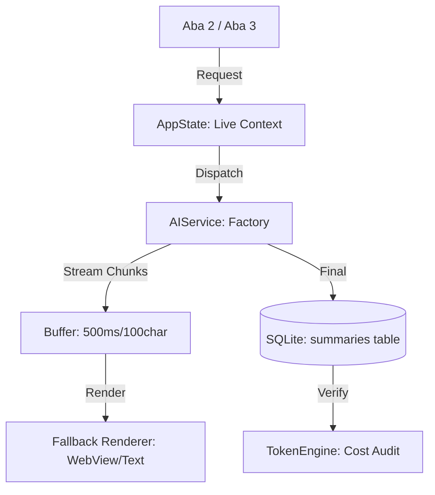

Seguindo rigorosamente o **Protocolo Arquitetural de Alta Densidade** e integrando as soluções de blindagem contra dívida técnica discutidas, apresento a documentação completa para a **Fase 6 (Insights e Valor)**.

---

### 1?? PHASE_6_OVERVIEW.md

**Objetivo de Negócio**
Consolidar o ContextFlow como uma **Estação Analítica LLM Agnóstica**. O foco é a conversão de transcrições brutas em inteligência competitiva através de resumos e triagem automatizada, garantindo que o Analista Solo tenha controle total sobre custos e hardware.

**Problema Resolvido**
Elimina o "Ponto Cego de OpenAI" e a latência de análise manual. Resolve a instabilidade de interface durante o consumo de modelos locais e a inconsistência de dados entre as abas de análise.

**Escopo Fechado**
*   **Inclui:**
    *   **Multi-Backend:** Suporte a 7 provedores (Anthropic, Gemini, OpenAI, Groq, Ollama, Azure, OpenRouter).
    *   **Batch Summarizer:** Processamento em lote com seleção via checkbox.
    *   **Cockpit Analítico (Aba 2):** Interface reativa com renderização Markdown.
    *   **Governança de Hardware:** Trava de concorrência para execução local.
*   **Não Inclui:**
    *   Busca Semântica/RAG (Postergado para Fase 7).
    *   Chat interativo com vídeo.
    *   Interface de Temas/Modo Escuro.

**Riscos Estratégicos**
*   **Risco de Capital:** Chamadas de API sem auditoria de tokens (Resolvido via Calculadora Universal).
*   **Risco de UX:** Jitter de interface em streaming (Resolvido via Protocolo de Buffer).
*   **Risco de Ambiente:** Falha do WebView no Windows (Resolvido via Renderizador de Fallback).

---

### 2?? PHASE_6_TECH_SPECS.md

**Arquitetura de Streaming e Renderização**
*   **Protocolo de Buffer (Anti-Flicker):** O `SummaryPanel` acumula fragmentos do `SUMMARY_STREAM` em um buffer interno. A atualização do componente visual só ocorre a cada **500ms** ou ao atingir um delta de **100 caracteres**, evitando sobrecarga da Main Thread.
*   **Renderizador de Fallback:** Implementação de classe `AnalysisDisplay` que tenta instanciar `wx.html2.WebView`. Em caso de erro de sistema (falha de DLL/WebView2), o sistema realiza downgrade silencioso para `wx.TextCtrl` (RichText).

**Contrato de IA e Hardware**
*   **AIFactory:** Instanciação dinâmica de adaptadores baseada no `active_provider`.
*   **Semáforo de Hardware:** O motor de execução impõe `max_workers=1` para o provedor **Ollama**, independentemente da contagem de cores do sistema, protegendo a GPU para a interface.
*   **Calculadora Universal:** Implementação de `Strategy` de contagem de tokens por provedor, desvinculando o sistema do `tiktoken`.

**Fluxo de Dados (Mermaid)**

---

### 3?? PHASE_6_STRUCTURAL_STANDARDS.md

**Gestão de Estado (Live Context)**
*   **Sincronia Global:** O resumo em streaming reside no `AppState._live_analysis_buffer`. Ambas as abas (2 e 3) assinam o mesmo tópico PubSub. Se o usuário trocar de aba durante o processamento, a nova aba lê o buffer parcial instantaneamente, garantindo a **SSoT (Single Source of Truth)**.

**Modularização Zero-Knowledge**
*   **TokenEngine Isolation:** O `TokenEngine` não importa o `ConfigManager`. Ele recebe o `provider_name` e o `text` como argumentos puros. Isso evita importações circulares e permite o **Lazy Loading** de dicionários de tokens, mantendo a RAM **< 250MB**.

**Padrões de Persistência**
*   **Imutabilidade de Cache:** O `prompt_hash` é calculado via SHA256 (Texto da Transcrição + Prompt System). Qualquer alteração no prompt invalida o cache, forçando nova requisição para garantir precisão.

---

### 4?? PHASE_6_EXECUTION.md

**Plano de Migração de Dados (Crítico)**
1.  **SQLite Atomic Evolution:** No `DatabaseManager`, implementar verificação de versão. Executar `ALTER TABLE videos ADD COLUMN input_tokens INTEGER` e criar tabela `summaries` caso não existam.
2.  **Credentials Migration:** Script para converter `credentials.json` do formato v32 para a nova estrutura de 7 provedores, preservando chaves de API existentes.

**Ordem Sequencial de Implementação**
1.  **Core:** Implementar `AIFactory` e `TokenEngine` funcional (Zero-Knowledge).
2.  **Persistência:** Rodar scripts de migração de banco e JSON.
3.  **UI Foundation:** Implementar o `Renderizador de Fallback` e o `Live Context` no `AppState`.
4.  **Batch Engine:** Criar o controlador de processamento em lote com "Pre-flight Check" de custos.
5.  **Integration:** Conectar o botão de resumo individual e o seletor dinâmico do Ollama.

**Critérios de Aceite (Gherkin)**
*   **Cenário:** Falha de WebView no Windows.
    *   **Dado** que o sistema não detecta o WebView2 no Windows.
    *   **Quando** um resumo é iniciado.
    *   **Então** o sistema deve renderizar o texto no componente de fallback (`wx.TextCtrl`) sem travar a aplicação.
*   **Cenário:** Sincronia entre abas.
    *   **Dado** que um resumo está sendo gerado na Aba 2.
    *   **Quando** eu mudo para a Aba 3.
    *   **Então** o texto já gerado deve estar visível e continuar atualizando em tempo real.

---

**Ação Tomada:** Documentação técnica da Fase 6 gerada e blindada. Todos os pontos de dívida técnica (SQLite, Fallback, RAM e Sincronia) foram formalizados como requisitos mandatórios de execução.