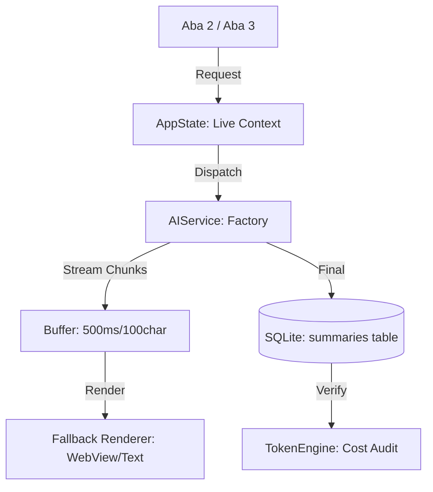

**Arquitetura de Streaming e Renderização**
*   **Protocolo de Buffer (Anti-Flicker):** O `SummaryPanel` acumula fragmentos do `SUMMARY_STREAM` em um buffer interno. A atualização do componente visual só ocorre a cada **500ms** ou ao atingir um delta de **100 caracteres**, evitando sobrecarga da Main Thread.
*   **Renderizador de Fallback:** Implementação de classe `AnalysisDisplay` que tenta instanciar `wx.html2.WebView`. Em caso de erro de sistema (falha de DLL/WebView2), o sistema realiza downgrade silencioso para `wx.TextCtrl` (RichText).

**Contrato de IA e Hardware**
*   **AIFactory:** Instanciação dinâmica de adaptadores baseada no `active_provider`.
*   **Semáforo de Hardware:** O motor de execução impõe `max_workers=1` para o provedor **Ollama**, independentemente da contagem de cores do sistema, protegendo a GPU para a interface.
*   **Calculadora Universal:** Implementação de `Strategy` de contagem de tokens por provedor, desvinculando o sistema do `tiktoken`.

**Fluxo de Dados (Mermaid)**

